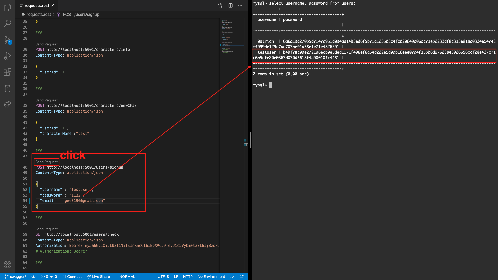
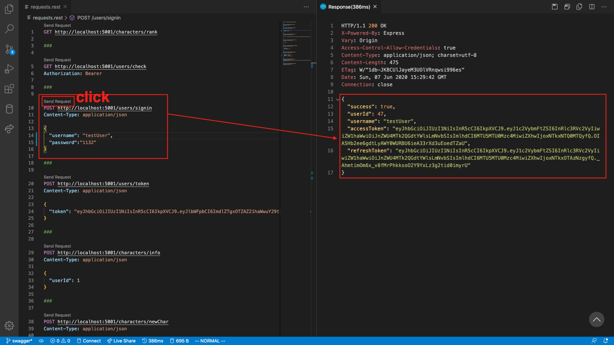
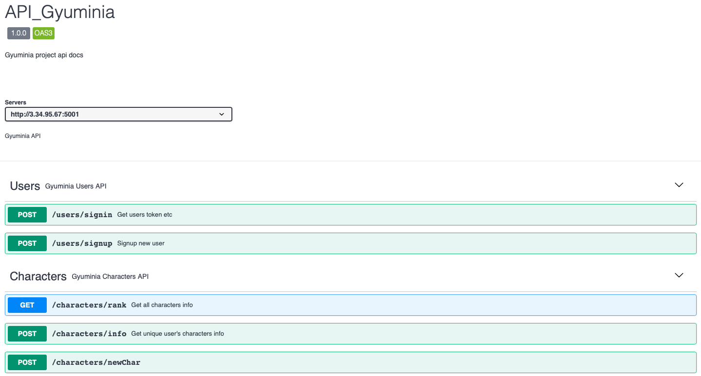

## Gyuminia Project Back-end

이 App은 Gyuminia 게임의 백엔드 부분을 다룹니다.

### Developer

김규동

### Stacks

Node.js(express), Sequelize, JWT, MySql, AWS(EC2), Docker

### Main techs

1. Node.js(express)를 사용한 웹 서버 구축
2. Sequelize를 사용한 MySql연동 및 Schema 적용
3. 다양한 API 구현(signin, signup, jwt token, characters info...)
4. 로그인, 회원가입 api 사용시 crypto library를 사용한 비밀번호 저장, 검색
5. Swagger를 사용한 api 명세서 작성

### 회원가입, 로그인시 Sequelize hooks로 password hashing 저장, 검색

### 로그인 accessToken, refreshToken 반환

### Swagger를 사용한 api 명세서 작성

https://app.swaggerhub.com/apis-docs/0strich/API_Gyuminia/1.0.0#/

